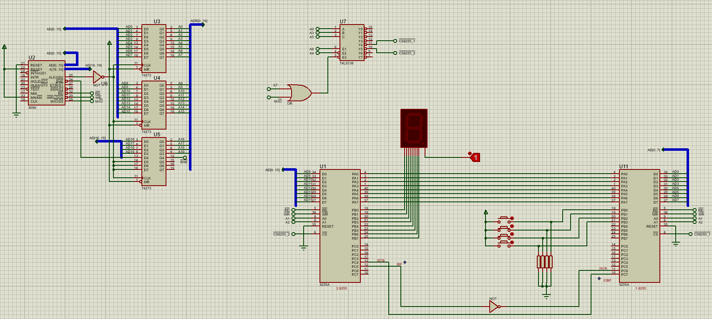

# Double 8255 Input Output 

In this circuit, one of the 8255 takes the input from the buttons and sends the buttons it reads to the second 8255. 

The second 8255 takes the input and shows what was being pressed on the 7SEG.

> This example does not work properly. It turns out there exists some problem in communication of 8255s. But I hope, it still helps you.

