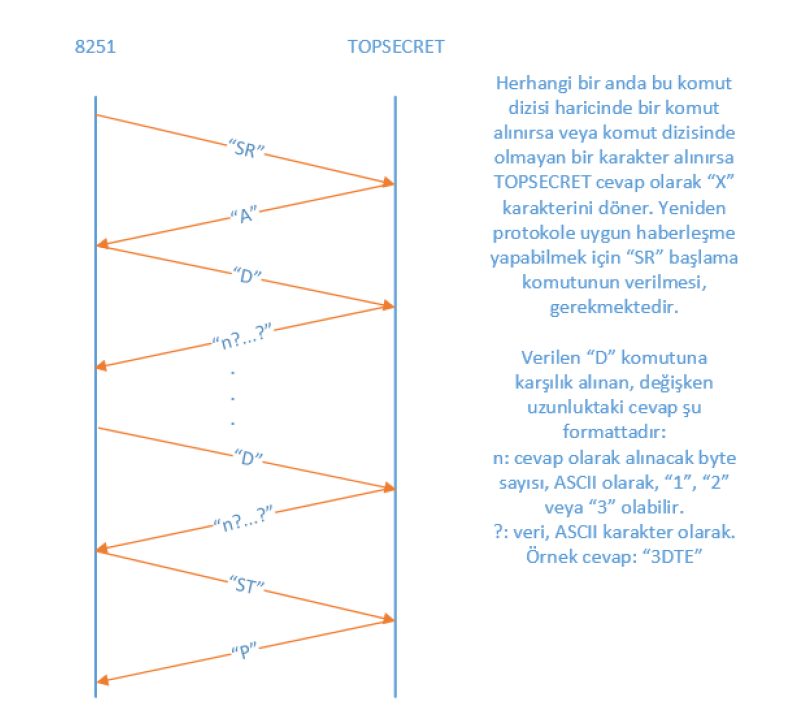
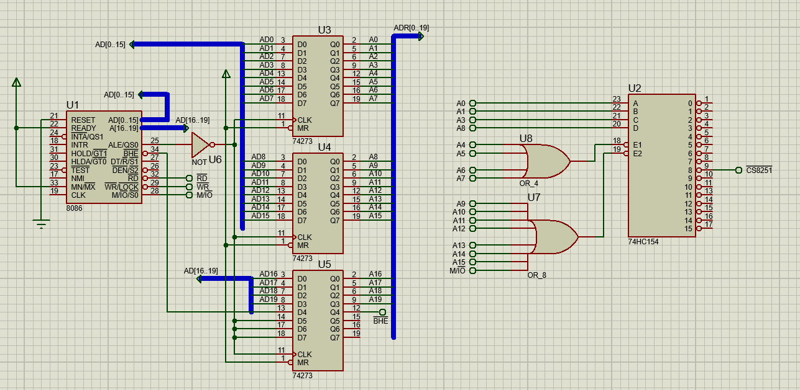
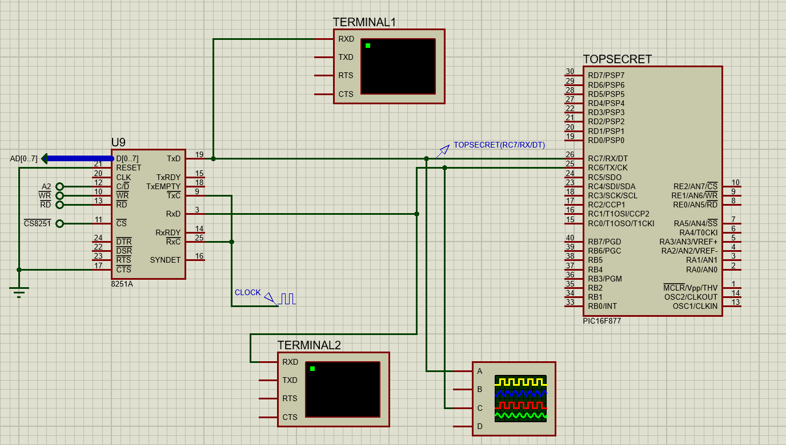

# Solve The Top Secret That You Get From 8251

In this problem, we need to get the top secret from a device. 
The device works as follows:
- We first send 'SR'
- Device sends 'A'
- We send 'D'
- Device sends the top secret in the following format
 - First, length of the top secret which can be either '1', '2' or '3'
 - Then, sends the actual top secret.
- After we get the top secret we send a request to close the communication by sending 'ST'.
- Device acknowledges us and terminates the communication by sending 'P'

* Following image summarizes the problem:

Note:

In order to configure the PIC16F877 chip, you need to use the TOPSECRET.conf file that can be found in this folder.

# Circuit

