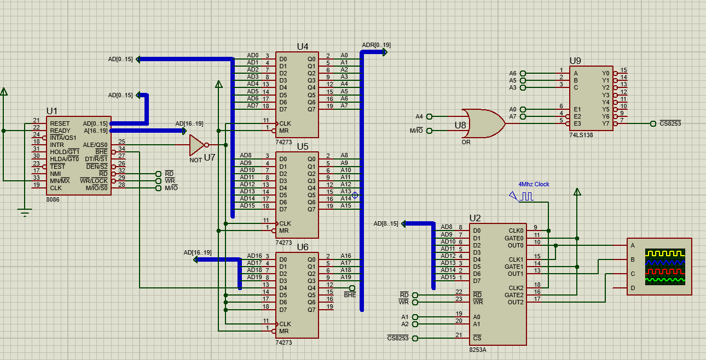

# Generate Pulse And Square Wave Using 8254

1. Generate periodic pulse wave by using 8254.
 - Generate 100 pulse wave in 5 seconds.
 - 8254 should be placed starting from the 69H address, consequtive odd numbers.
 - Clock 4Mhz

2. Generate square wave by using 8254.
 - Generate 10000 square wave in 5 seconds.
 - 8254 should be placed starting from the 69H address, consequtive odd numbers.
 - Clock 4Mhz

## Circuit

## Solution

