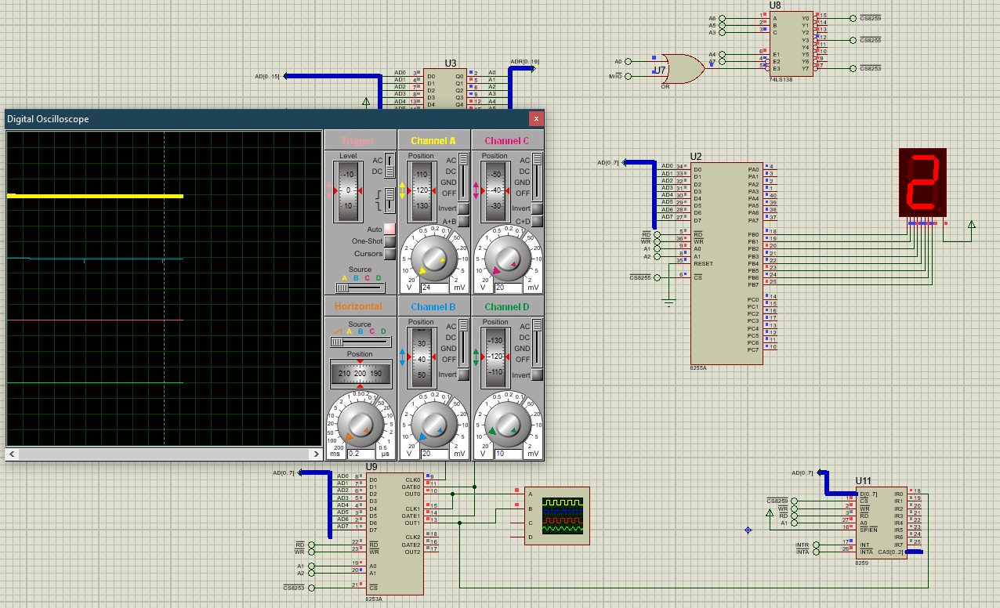
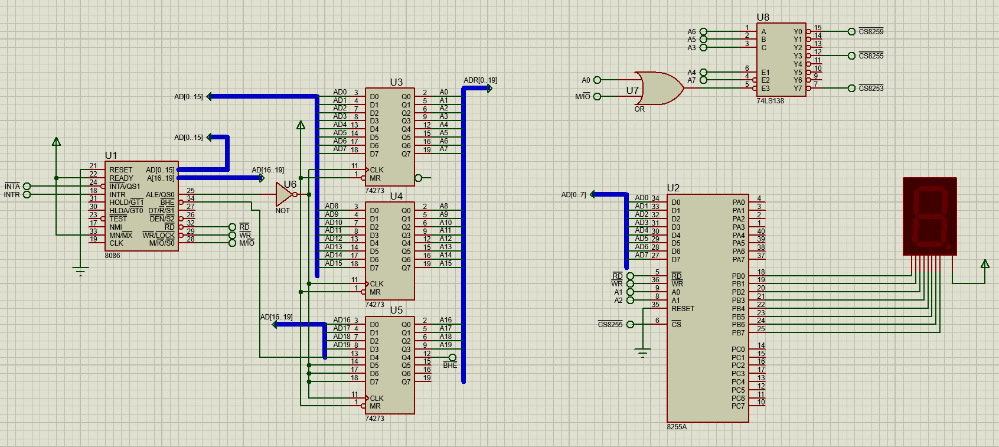
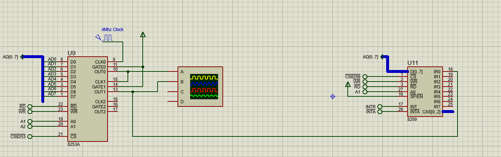

# 8259 User Defined Interrupts

Here the problem is to increment the AX register every 15 seconds.

We create our own interrupt and by using 8253, we generate interrupts every 15 seconds using 8259.

## Solution

## Circuit

